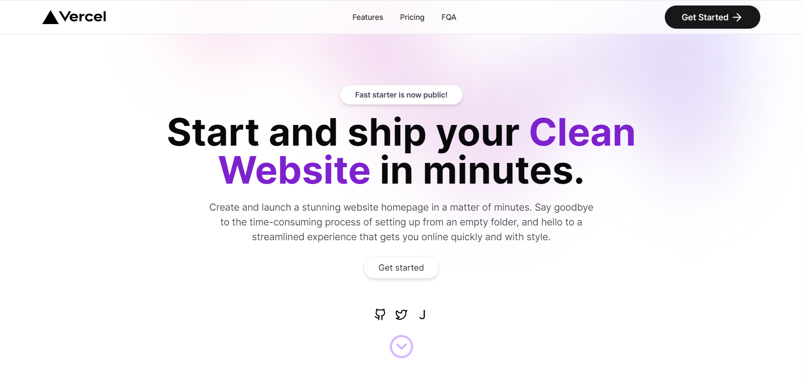

# Landing Page -- by Sawana

施工中。。。

但你已经可以在网站中试用！

[示例网址](https://landingpage.sawana.site/)

## 特性

目前还在施工中，不过已经有如下特性：

- 完善的视图 -- 在[示例网址](https://landingpage.sawana.site/)中尝试

- i18n 框架 -- 自动识别用户浏览器语言，可设置支持语言。`src\middleware.ts`/`src\app\[lang]\dictionaries.js`，通过`src\lib\dictionaries\`维护翻译字典。引入方法见`src\app\[lang]\page.tsx`

- kinde 鉴权 -- https://kinde.com/

- analysis -- 百度统计/谷歌统计

## 更新中

- [ ] prisma数据库集成

- [ ] 统一配置文件

- [ ] light/dark模式

- [ ] 切换语言按钮

- [ ] wall of love
 
## 关于我

我是一个正在学习和实现网站开发的开发者，希望在今年运营出一个 MRR $100 的作品。

如果你发现了什么问题、可改进的地方，或者只是想随意地聊聊天，都非常欢迎联系我！

即刻 @Sawana

X @HSawana9